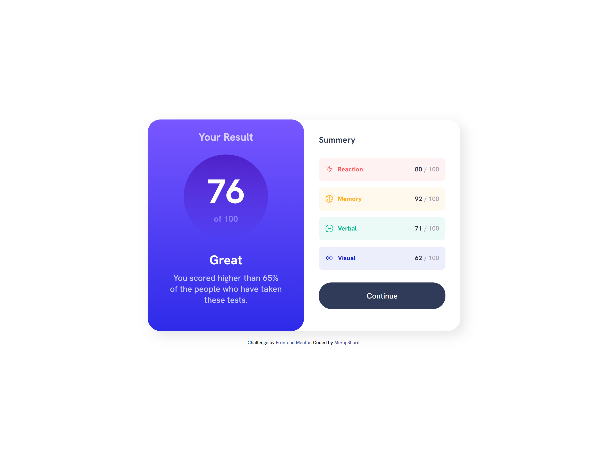

# Frontend Mentor - Results summary component solution

## Table of contents

- [Screenshot](#screenshot)
- [Links](#links)
- [Built with](#built-with)
- [Author](#author)

### Screenshot

### Links

- Solution URL: [solution URL]()
- Live Site URL: [live site URL](https://meraj-sharif-khan.github.io/results-summary/)

### Built with

- Semantic HTML5 markup
- CSS custom properties
- Flexbox
- Mobile-first workflow

## Author

- Frontend Mentor - [@MerajSharif](https://www.frontendmentor.io/profile/Meraj-Sharif-Khan)
